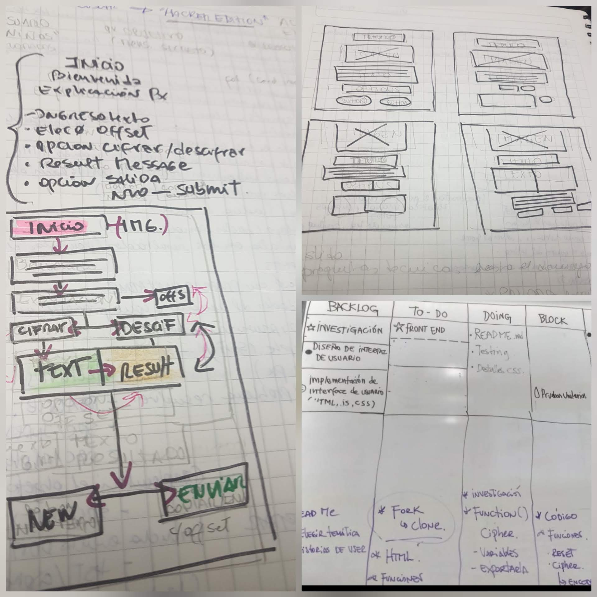
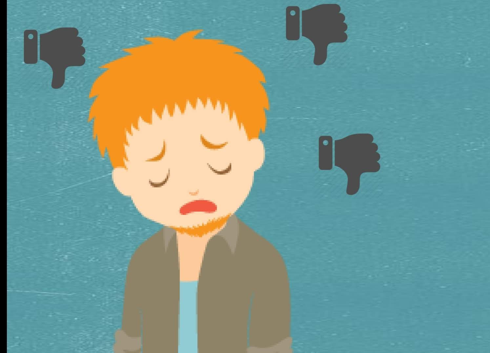
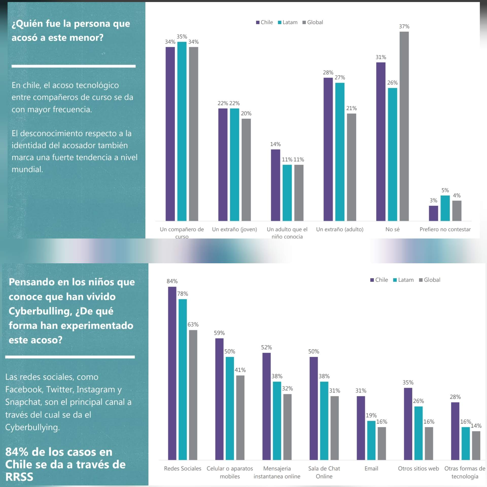
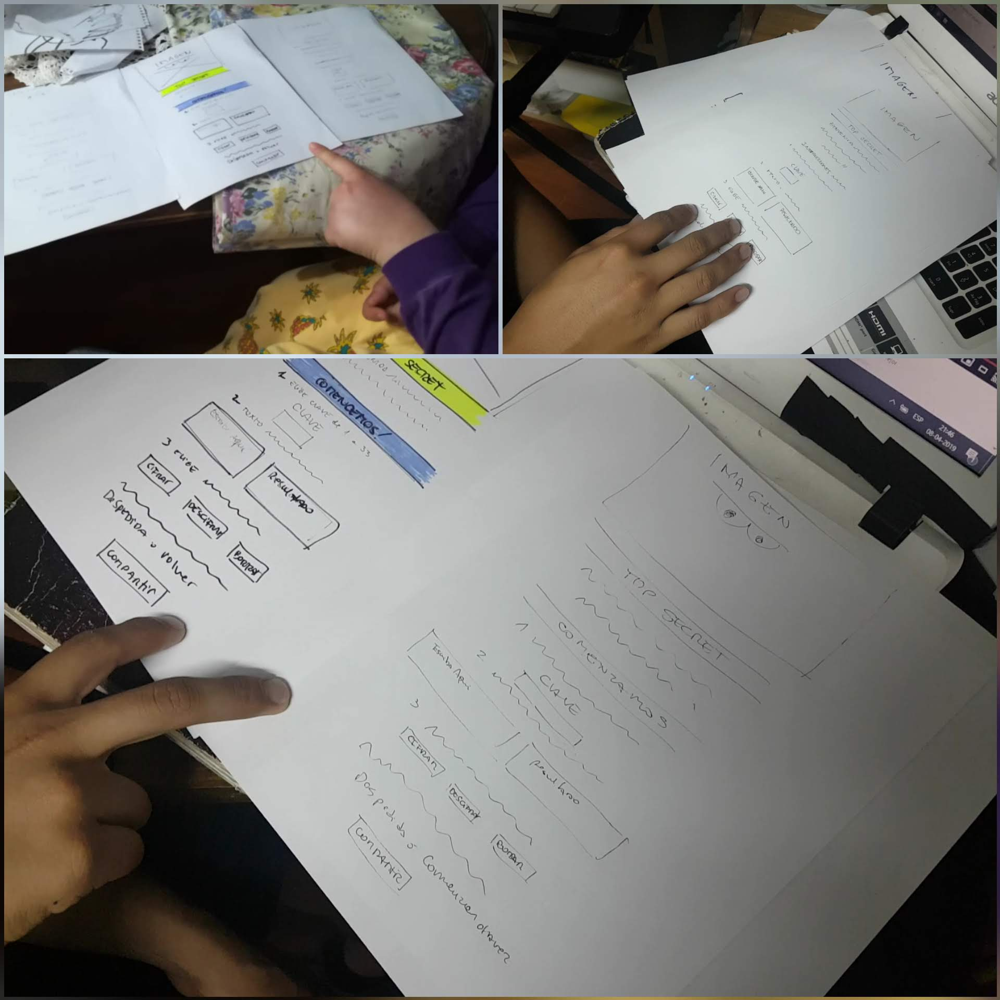
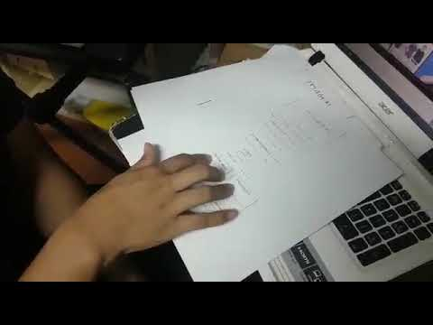
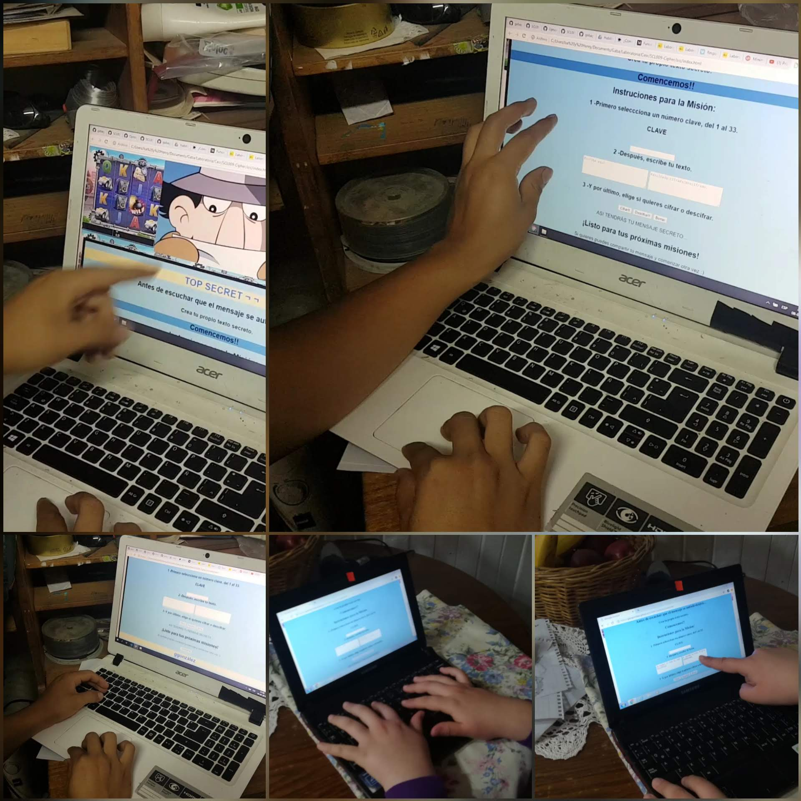
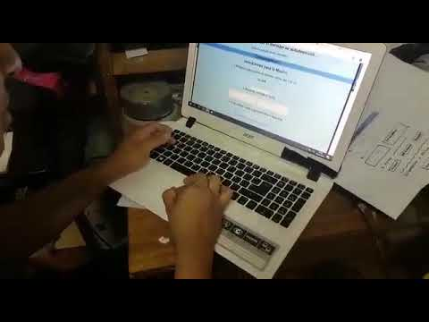
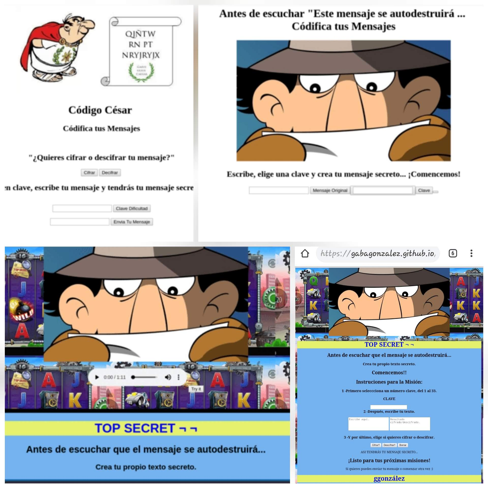

# TOP SECRET 
### Mensaje Secreto con Cifrado César

----------------------------------------
QUÉ ES? &#128559;
-----------------------
Web APP, para cifrar o decifrar texto, usando cifrado César.
Pero ¿qué es cifrar?, Cifrar, significa codificar. Y el [cifrado César](https://en.wikipedia.org/wiki/Caesar_cipher) es uno de los primeros métodos de cifrado conocidos. Antiguamente lo usaban para enviar órdenes secretas a generales en los campos de batalla.
El cifrado césar es una de las técnicas más simples para cifrar un mensaje. Es un tipo de cifrado por sustitución, es decir que cada letra del texto original es reemplazada por otra que se encuentra un número fijo de posiciones (desplazamiento) más adelante en el mismo alfabeto.

------------------------------------------
-------------------------------------------
## Resumen del proyecto
En la Novena generación de Laboratoria SCL, se nos planteó el desafió de una AppWeb de tematica libre, pero considerando como principal función el cifrado césar. Para esta ardua tarea comenzamos, planteando las siguientes etapas;

### Planificación
- Aplicación de [Trello](https://trello.com/b/ZLTgo5cX/cifrado)

- Esquemas, Flujos, Prototipos de Baja Fidelidad.

### Definición de la Problemática:
" BULLYING escolar".

El primer informe de bullying escolar (2018) realizado por la Superintendencia de Educación, se puede considerar una cruda realidad sobre estas materias .
Desde las autoridades, pasando por los padres, apoderados y profesores están en la búsqueda de mecanismos que ayuden a combatir esta práctica, razón por la cual se realizó el primer informe donde consideraron todo tipo de establecimientos, obteniendo datos no menores; como lo es la diferencia entre los cursos. 
El nivel donde se presentó `la mayor cifra de denuncias fue tercero básico`, alcanzando un 21% de éstas.
Sobre los espacios donde los niños son víctimas de estas agresiones, el estudio señala que `el lugar donde más se da es dentro de la propia sala de clases (35,8%)`. El segundo lugar es ocupado por el patio (26,7%), es seguido por "distintas partes" (10,2%), exterior del establecimiento (7,4%), baño (6,3%), puerta del establecimiento (5,7%), otro (2,8%), pasillo (2,3%), furgón escolar (1,7%), casino (0,6%) y cancha (0,6%).

### Radiografía a los niños chilenos. &#129299;
(EstudioGfK)

Según estudio del 2017 la gran mayoría de los niños que viven en Chile consideran que tienen “muchos” (51%), o al menos, un número normal de amigos (35%). Sólo el 14% se siente solo. `El colegio (85%),el barrio donde viven (57%) y la plaza (10%) son los lugares de excelencia para generar vínculos de amistad`.
Para la generación que nació con internet, la red es un medio principalmente utilizado para entretenerse, ya sea viendo videos (63%)o jugando (57%), según los llamados nativos digitales.
Como ejemplo algunos resultados obtenidos en la reciente entrega de Resultados Educativos 2016, donde en 2do medio se apreció que un 54% de los estudiantes declara que las normas de convivencia no son conocidas por todos los estudiantes; que un 58% dice que en su establecimiento las personas no se tratan con respeto y que un `52% declara que no se conversa en clases sobre los efectos del maltrato o intimidación entre compañeros`.

### Referencias de Investigación 

- [GFK](https://www.gfk.com/es-cl/insights/press-release/estudiogfk-radiografia-a-los-ninos-chilenos/ )

- [Publimetro](https://www.publimetro.cl/cl/noticias/2018/04/11/bullying-ninos-chilenos.html)

- [Unicef](https://www.agenciaeducacion.cl/noticiascepal-unicef-publican-estudio-la-violencia-espacio-escolar/ )

- [Ipsos](www.ipsos.cl)

## Entonces ¿ Quiénes son nuestros usuarios? 

Principales usuarios de producto: Niños, preadolecentes, en etapa escolar desde los **8 a los 16 años**. Nativos digitales.

**Desarrollo afectivo – social de los usuarios**
- El grupo de pares es el que ejerce la mayor influencia, al tiempo de que la influencia de los padres es menor.
- Se crean jerarquías determinadas por afinidades comunes.
- Aparece el amigo o amiga íntima con quien comparten intimidades y secretos.
- Se da la aceptación incondicional de algo y el rechazo irracional del resto.
- La conciencia de la libertad individual adquiere gran importancia, asi como los prejuicios y diferencias con sus pares.

## Definición del producto
Dentro de los objetivos de la relación del producto con el usuario: 
La webApp.podria ser parte de una serie de herramientas que se puede poner a disposición en establecimientos educacionales.
Pensando en ella, como la forma de acercar temáticas educativas; enseñando a los niños la utilidad de poder cifrar texto.También como herramienta de prevención; pudiendo el niño hacer llegar sus mensajes cifrados a sus pares, profesores u orientadores entre otros, una alternativa de poder comunicarse de forma mas segura ante eventos que lo requieran. Y todo bajo una temática lúdica para acercar a los niños/ preadolecentes a interactuar con ella.

## Proceso

#### Test Usabilidad
Diseño de experiencia de usuario (UX):

- Prototipado (sketching)
- Testeo e Iteración

### Desición de diseño

- Ideación

## CÓMO SE USA
-----------------------------------------
## Introducción a la aplicación
Aplicación web que interactúe con el usuario a través del navegador y la lógica basada en esa interacción que servirá para que el usuario pueda cifrar y descifrar un texto indicando un desplazamiento específico de caracteres (_offset_/ Clave).

## Su funcionalidad 
Consideraciones generales
Mensajería secreta para que niños puedan utilizar en el ambiente escolar para comunicarse entre sus pares y/o profesores a quienes acudir a solucionar la problematica.

## Interfaz de usuario

La interfaz permite al usuario:
- Elegir un desplazamiento (_offset_) indicando cuántas posiciones queremos que el cifrado desplace cada caracter.
- Insertar un mensaje (texto) que queremos cifrar.
- Ver el resultado del mensaje cifrado.
- Insertar un mensaje (texto) a descifrar.
- Ver el resultado del mensaje descifrado.

## Links relacionados
- https://gabagonzalez.github.io/SCL009-Cipher/src/index.html

- https://gabagonzalez.github.io/SCL009-Cipher/

- https://github.com/gabagonzalez/SCL009-Cipher

- https://trello.com/b/ZLTgo5cX/cifrado

